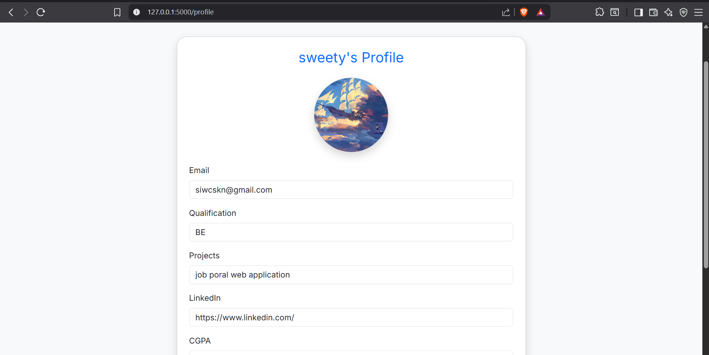

# 🧑‍💼 Job Portal Web App

A Flask-based job portal application that allows **job seekers** to register, apply, and save jobs, and **employers** to post and manage job listings. Admins can view all data in a dashboard.

---

## 🔧 Features

* ✅ User Registration and Login (Roles: Seeker, Employer, Admin)🧑‍💼 Job Portal Web App

  ## A Flask-based job portal application that allows **job seekers** to register, apply, and save jobs, and **employers** to post and manage job listings. Admins can view all data in a dashboard.

  ## 🔧 Features

  * ✅ User Registration and Login (Roles: Seeker, Employer, Admin)
  * 👤 Profile Management with:

    * Resume upload
    * Profile image upload
    * Qualification, LinkedIn, CGPA, Projects
  * 💼 Job Posting (Employers) with:

    * Job title, description, salary, location, company
    * Expiration date support (auto show as expired)
  * 🔍 Advanced Job Search:

    * Filter by keyword, company, location, salary
  * 📅 Apply for Jobs (Job Seekers)
  * 🔾 Save Jobs to view later
  * 📄 Employer Dashboard:

    * View applications and download resumes
  * 🛠 Admin Panel:

    * View all users, jobs, and applications

  ---

  ## 📁 Folder Structure

  ```
  job-portal/
  ├── main.py                   # Main Flask application
  ├── models.py                 # SQLAlchemy models
  ├── forms.py                  # WTForms classes
  ├── requirements.txt          # Required packages
  ├── templates/                # HTML templates using Jinja2
  │   ├── base.html
  │   ├── index.html
  │   ├── login.html
  │   ├── register.html
  │   ├── profile.html
  │   ├── dashboard.html
  │   ├── post_job.html
  │   ├── job_detail.html
  │   ├── apply_form.html
  │   ├── saved_jobs.html
  │   ├── applications.html
  │   └── admin.html
  ├── static/                   # Static files (CSS, JS, images)
  │   ├── profile_images/       # Uploaded profile pictures (excluded from version control)
  │   └── resumes/              # Uploaded resumes (excluded from version control)
  ├── uploads/                  # For any uploaded documents (excluded from version control)
  │   ├── *.txt, *.pdf          # Uploaded files
  ├── instance/                
  │   └── jobportal.db          # SQLite database (excluded from Git)
  ├── .gitignore                # Files/folders to exclude from Git
  ├── README.md                 # Project documentation
  └── LICENSE                   # License file

  ```

  ---

  ## 💻 Installation

  ```
  git clone https://github.com/yourusername/job-portal.git
  cd job-portal

  ```

  Create a virtual environment and activate it:

  ```
  python -m venv venv
  # On Windows:
  venv\Scripts\activate
  # On Mac/Linux:
  source venv/bin/activate

  ```

  Install dependencies:

  ```
  pip install -r requirements.txt

  ```

  ---

  ## ⚙️ Setup

  1. Create necessary folders if they don’t exist:

  ```
  mkdir instance static/uploads static/profile_images static/resumes

  ```

  2. Inside `main.py`, ensure database creation is handled:

  ```
  if not os.path.exists("instance/jobportal.db"):
      db.create_all()

  ```

  3. Run the application:

  ```
  python main.py

  ```

  4. Visit: [http://127.0.0.1:5000](http://127.0.0.1:5000/)

  ---

  ## 🔐 Admin Login

  Manually insert an admin user into the database if needed:

  ```
  from models import db, User
  admin = User(username="admin", password="admin123", role="admin")
  db.session.add(admin)
  db.session.commit()

  ```

  ---

  ## 🖼️ Screenshots

  | Homepage Login Register      |   |   |
  | ---------------------------- | - | - |
  |                              |   |   |
  | Profile Page Job Detail Page |   |   |
  | ---------------------------- | - |   |
  |                              |   |   |

  > Place all screenshots in a `screenshots/` folder at the root of the repository.

  ---

  ## 🚫 .gitignore Example

  ```
  venv/
  __pycache__/
  instance/
  *.pyc
  uploads/
  static/profile_images/
  static/resumes/

  ```

  ---

  ## 📜 License

  ## This project is licensed under the **MIT License**. See the `LICENSE` file for more information.

  ## 🙋‍♂️ Author

  Dharani — [LinkedIn](https://www.linkedin.com/in/your-profile)

  > "Your dream job is waiting. Keep applying and never give up!"
  > 👤 Profile Management with:

  * Resume upload
  * Profile image upload
  * Qualification, LinkedIn, CGPA, Projects
* 💼 Job Posting (Employers) with:

  * Job title, description, salary, location, company
  * Expiration date support (auto show as expired)
* 🔍 Advanced Job Search:

  * Filter by keyword, company, location, salary
* 📅 Apply for Jobs (Job Seekers)
* 🔾 Save Jobs to view later
* 📄 Employer Dashboard:

  * View applications and download resumes
* 🛠 Admin Panel:

  * View all users, jobs, and applications

---

## 📁 Folder Structure

```
job-portal/
├── main.py                   # Main Flask application
├── models.py                 # SQLAlchemy models
├── forms.py                  # WTForms classes
├── requirements.txt          # Required packages
├── templates/                # HTML templates using Jinja2
│   ├── base.html
│   ├── index.html
│   ├── login.html
│   ├── register.html
│   ├── profile.html
│   ├── dashboard.html
│   ├── post_job.html
│   ├── job_detail.html
│   ├── apply_form.html
│   ├── saved_jobs.html
│   ├── applications.html
│   └── admin.html
├── static/                   # Static files (CSS, JS, images)
│   ├── profile_images/       # Uploaded profile pictures (excluded from version control)
│   └── resumes/              # Uploaded resumes (excluded from version control)
├── uploads/                  # For any uploaded documents (excluded from version control)
│   ├── *.txt, *.pdf          # Uploaded files
├── instance/                
│   └── jobportal.db          # SQLite database (excluded from Git)
├── .gitignore                # Files/folders to exclude from Git
├── README.md                 # Project documentation
└── LICENSE                   # License file
```

---

## 💻 Installation

```bash
git clone https://github.com/yourusername/job-portal.git
cd job-portal
```

Create a virtual environment and activate it:

```bash
python -m venv venv
# On Windows:
venv\Scripts\activate
# On Mac/Linux:
source venv/bin/activate
```

Install dependencies:

```bash
pip install -r requirements.txt
```

---

## ⚙️ Setup

1. Create necessary folders if they don’t exist:

```bash
mkdir instance static/uploads static/profile_images static/resumes
```

2. Inside `main.py`, ensure database creation is handled:

```python
if not os.path.exists("instance/jobportal.db"):
    db.create_all()
```

3. Run the application:

```bash
python main.py
```

4. Visit: [http://127.0.0.1:5000](http://127.0.0.1:5000)

---

## 🔐 Admin Login

Manually insert an admin user into the database if needed:

```python
from models import db, User
admin = User(username="admin", password="admin123", role="admin")
db.session.add(admin)
db.session.commit()
```

---

## 🖼️ Screenshots
> HOME PAGE


>LOGIN PAGE


> REGISTER PAGE


> PROFILE PAGE



> Place all screenshots in a `screenshots/` folder at the root of the repository.

---

## 🚫 .gitignore Example

```
venv/
__pycache__/
instance/
*.pyc
uploads/
static/profile_images/
static/resumes/
```

---

## 📜 License

This project is licensed under the **MIT License**. See the `LICENSE` file for more information.

---

## 🙋‍♂️ Author

Dharani — [LinkedIn](https://www.linkedin.com/in/dharani-d-30a77431b/)

)

> "Your dream job is waiting. Keep applying and never give up!"
