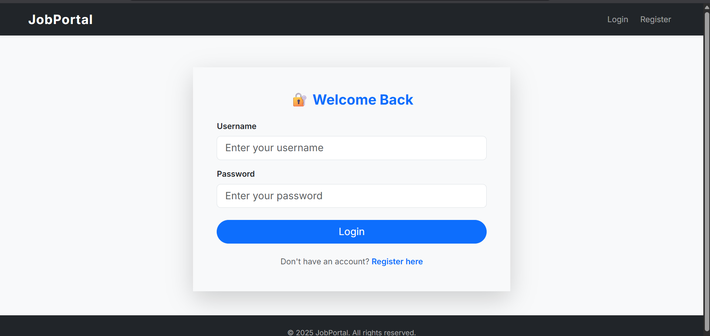

# 🧑‍💼 Job Portal Web App

A modern, full-featured job portal built using **Flask** that allows job seekers to register, apply, and manage jobs, while employers can post jobs, track applications, and download resumes. The admin panel gives complete control over users, jobs, and applications.

---

## 🔧 Features

### 👤 Job Seekers
- Register and login
- Update profile with resume, profile image, qualifications, CGPA, LinkedIn, and project links
- Search jobs using advanced filters (keyword, company, location, salary)
- Apply for jobs with one click
- Save jobs for later
- View applied and saved jobs

### 🏢 Employers
- Register and login as company
- Post jobs with expiration date, salary, location, and description
- View applications for posted jobs
- Download applicant resumes
- Manage job postings

### 🛠 Admin Panel
- View and manage all users
- View all posted jobs and applications

---

## 📁 Folder Structure

```
job-portal/
├── job_portal/
│   ├── main.py               # Main Flask application
│   ├── models.py             # SQLAlchemy models
│   ├── forms.py              # Flask-WTF forms
│   ├── templates/            # Jinja2 HTML templates
│   ├── static/               # CSS/JS/uploads
│   └── __init__.py (optional)
├── requirements.txt          # Project dependencies
├── Procfile                  # For deployment on Render
├── .render.yaml              # Render deployment config
├── instance/                 # Local database (SQLite)
│   └── jobportal.db
├── .gitignore
└── README.md
```

---

## ⚙️ Setup Instructions

```bash
git clone https://github.com/Dharani-2709/job-portal-flask.git
cd job-portal-flask

# Create virtual environment
python -m venv venv
venv\Scripts\activate  # Windows
# OR
source venv/bin/activate  # macOS/Linux

# Install dependencies
pip install -r requirements.txt

# Run the application
python job_portal/main.py
```

App runs at: [http://127.0.0.1:5000](http://127.0.0.1:5000)

---

## 🛫 Deployment (Render.com)

Ensure the following files exist at the repo root:
- `requirements.txt`
- `Procfile`
- `.render.yaml`

### `Procfile`
```
web: gunicorn job_portal.main:app
```

### `.render.yaml`
```yaml
services:
  - type: web
    name: job-portal-flask
    env: python
    buildCommand: "pip install -r requirements.txt"
    startCommand: "gunicorn job_portal.main:app"
    envVars:
      - key: FLASK_ENV
        value: production
      - key: SECRET_KEY
        value: secretkey
```

---

## 📸 Screenshots

Place your screenshots in the `/screenshots/` folder and link them here:

- 🏠 Home Page  

- 🔐 Login Page 

- 📝 Register Page  

- 👤 Profile Page  

- 💼 Dashboard (Seeker)  

- 💼 Dashboard (Employer)


---

## 🚫 .gitignore Sample

```
venv/
__pycache__/
instance/
uploads/
*.pyc
*.db
*.sqlite3
static/resumes/
static/profile_images/
```

---

## 👨‍💻 Author

**Dharani D**  
Python Developer Intern  
[LinkedIn](https://www.linkedin.com/in/dharani-d-30a77431b/)  
[GitHub](https://github.com/Dharani-2709)

---

> “Your dream job is waiting. Keep building, keep applying.”
